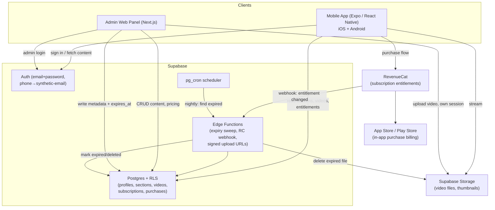
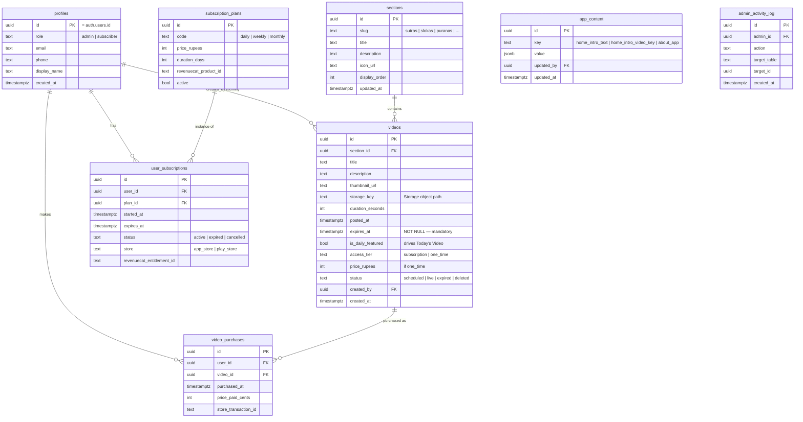
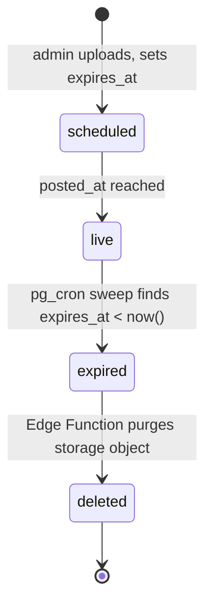

# Storytelling App — Architecture & Data Model

Status: draft v1 · Owner: TBD · Last updated 2026-08-21

This document covers system architecture, auth design, the full data model, video lifecycle, subscriptions/payments, and the storage decision. It's the source of truth to build against — update it when a decision changes.

> **Update, 2026-08-21 — video storage is Supabase Storage, not R2.** The R2 plan below was the original recommendation and the reasoning still holds if you want to move to it later. In practice, R2 requires a card or PayPal on file to activate at all (even for free-tier usage), which wasn't available — so the app currently uses **Supabase Storage** instead: a public `videos` bucket with admin-only write policies, uploaded to directly using the signed-in user's own session (no presigned-URL step, no separate storage credentials). This is a drop-in swap, not a compromise — the `videos` table still just stores a key/URL, so moving to R2 or anywhere else later doesn't touch the data model. See `supabase/README.md` and migration `0007_storage.sql`.

---

## 1. Decisions made this round

**Video storage — Cloudflare R2, not Bunny or Cloudflare Stream.** *(superseded — see the update note above; currently running on Supabase Storage instead, for the reason stated there.)*
Neither Bunny Stream nor Cloudflare Stream has a free tier — both are pay-as-you-go from the first GB (Bunny ≈ $0.005/GB storage + cheap egress; Cloudflare Stream ≈ $5 per 1,000 minutes stored). Given that most videos are deleted within a day or a week, the actual storage footprint at any moment stays small, which changes the calculus:

- **Cloudflare R2**: 10 GB storage and all egress free, permanently (no trial window). No built-in transcoding or adaptive bitrate — you upload an MP4, the app plays it back via progressive download/native `<Video>` component. For 30–60 minute talking-head/narration-style videos at a reasonable bitrate, this is fine on mobile and costs nothing at your rotation volume.
- Recommendation: **launch on R2**. If the catalog grows past ~10 GB resident at once, or you want adaptive bitrate for weak connections, upgrade the *storage* layer to Bunny Stream without touching the rest of the app — the video table stores a URL, not a vendor lock-in.

**Auth — build email+password and phone+password together, on one identity system.**
Supabase Auth natively supports email+password. It doesn't support phone+password without OTP out of the box (phone auth assumes SMS verification, which costs money). Rather than run two separate auth systems, phone sign-up maps to a synthetic internal email (`<phone>@phone.internal`) under the hood and reuses the same Supabase Auth session, RLS, and refresh-token machinery as email accounts. See §3.

---

## 2. System architecture

**Why this shape:** Supabase is the single backend (auth + DB + storage + serverless functions + scheduling) so there's one place to reason about permissions and state. Storage only ever holds bytes — no business logic lives there, and writes are gated by `storage.objects` RLS rather than a separate credentialed service. RevenueCat is the only component allowed to touch real billing, because Apple/Google require IAP for digital subscriptions inside a native app; a custom payment gateway for subscriptions would get the app rejected.

---

## 3. Auth & session design

**Two front-end entry points, one identity backend:**

| Entry point | What the user enters | What actually happens |
|---|---|---|
| Email sign-up | email + password | `supabase.auth.signUp({ email, password })` — standard |
| Phone sign-up | phone + password | App builds `syntheticEmail = phone.replace(/\D/g,'') + '@phone.internal'`, calls `signUp({ email: syntheticEmail, password })`. Real phone number is written to `profiles.phone` for display/lookup. No SMS, no OTP, no per-verification cost. |
| Sign-in (either) | same credential | Looked up the same way — email as typed, or phone converted to the same synthetic address — then `signInWithPassword`. |

**Persistent, no-expiry session:** Supabase issues a JWT + refresh token. Store both in Expo `SecureStore` (not `AsyncStorage` — SecureStore is encrypted at rest). The Supabase client auto-refreshes the access token using the refresh token, which itself doesn't expire until explicit sign-out or revocation. Result: open the app after a week, still logged in, no re-auth prompt — matches the "log in once until sign-out" requirement.

**Autofill / save-credentials:** use standard platform autofill hooks — `textContentType="username"/"password"` (iOS) and `autoComplete="username"/"password"` (Android) on the login inputs. This gets native "save password" prompts for free; no custom credential cache needed.

**Password storage:** never store or handle raw passwords yourself — Supabase Auth hashes and stores them (bcrypt) in its own `auth.users` table. The synthetic-email trick only changes the *identifier*, not how the password is handled.

**Roles:** a `role` column on `profiles` (`admin` | `subscriber`), checked in Postgres RLS policies — not just in app code — so an admin-only mutation is rejected at the database layer even if the client is compromised or bypassed.

---

## 4. Data model

Notes on a few columns:

- `videos.expires_at` is `NOT NULL` at the schema level — the app can't save a video without it, matching the "strictly mandatory" requirement.
- `videos.is_daily_featured` is how **Today's Video** works: the home screen button queries `videos WHERE is_daily_featured = true AND status = 'live' ORDER BY posted_at DESC LIMIT 1` and deep-links straight to that video's section/player. The admin toggles this flag when uploading that day's video; only one should be true at a time (enforced with a partial unique index `WHERE is_daily_featured`).
- `app_content` is a flexible key-value table backing the editable home-page copy and the static 2–3 minute intro video — admin edits rows here instead of every string needing its own migration.
- `admin_activity_log` gives you an audit trail for who changed pricing, deleted a video early, etc. — cheap insurance, not overengineering, given money and content deletion are both involved.

**Row Level Security, in plain terms:**
- `profiles`: a user can read/update their own row; admins can read all.
- `sections`, `app_content`: readable by anyone signed in; writable only by `role = 'admin'`.
- `videos`: readable if `status = 'live'` **and** (`access_tier = 'subscription'` and the user has a row in `user_subscriptions` with `status = 'active'` and `expires_at > now()`) **or** (a matching `video_purchases` row exists) **or** the user is an admin. Writable only by admins.
- `user_subscriptions`, `video_purchases`: insert only via the RevenueCat-webhook Edge Function (service role), never directly from the client — prevents a user granting themselves a subscription.

---

## 5. Video lifecycle

- Admin upload form (in the admin panel) asks for: title, description, section, thumbnail, video file, duration (auto-detected), access tier (subscription-gated vs. pay-per-video + price), and **expiry date** (required, defaults suggested per section — e.g. daily uploads default to +1 day, weekly-tier content to next Sunday).
- Upload flow: admin panel (or the in-app Admin tab) uploads the file directly to the `videos` Supabase Storage bucket using the signed-in admin's own session — `storage.objects` RLS enforces admin-only writes, so there's no presigned-URL step or separate storage credentials — then writes the row to `videos` with the resulting object key.
- `pg_cron` runs nightly (e.g. 2:00 AM), calling an Edge Function that: finds `videos WHERE status='live' AND expires_at < now()`, deletes the storage object, sets `status='deleted'`. Weekly-tier content simply gets `expires_at` set to the following Sunday at upload time — no separate "weekly" code path needed.

---

## 6. Subscriptions & payments

- **RevenueCat** sits between the app and each store's IAP system, tracking entitlements (`daily`, `weekly`, `monthly`, or a per-video one-off) without you writing StoreKit/Play Billing code directly.
- Subscription flow: user taps a plan → RevenueCat presents the store's native purchase sheet → store confirms → RevenueCat fires a webhook → `revenuecat-webhook` upserts `user_subscriptions` → app re-checks entitlement via RLS-gated query.
- Pay-per-video flow is different, because it has to be: a store IAP product is a fixed price point, not a dynamic per-video price, and the webhook's `product_id` alone can't say *which* video a ₹99 tier purchase was for when many videos share that tier. So: `video_purchase_tiers` holds a small admin-managed set of fixed prices (each wired to one real store product); a pay-per-video video's price must match one of them; the client buys that tier's product, then calls `purchase-video` with the video id + the resulting transaction id; that function re-verifies the transaction against RevenueCat's own API server-side (never trusting the client's say-so) before inserting into `video_purchases`.
- Pricing lives in `subscription_plans` / `videos.price_rupees` in your DB (whole rupees, e.g. 199 = ₹199 — not paise), but the **actual chargeable products must also be created in App Store Connect and Google Play Console** with matching IDs (`revenuecat_product_id`) — the store, not your database, is the source of truth for what a user is actually billed.
- Take rate: Apple/Google take 15–30% of IAP revenue. Factor this into pricing; there's no way around it for content unlocked inside a native app.

---

## 7. Admin panel structure

- **Sections page** — list of top-level topics (Sutras, Slokas, Puranas, …), add/edit/reorder/delete, each with title + description + icon.
- **Section detail → Videos** — CRUD for videos within a section: upload, edit metadata, toggle "today's featured video," force-expire early, view purchase/view counts.
- **Pricing page** — edit `subscription_plans` (daily/weekly/monthly price) and per-video pricing.
- **Home content page** — edit the app's intro copy and swap the static intro video, backed by `app_content`.
- **Activity log** — read-only view of `admin_activity_log` for accountability.
- Auth: same Supabase session as the mobile app; every mutation goes through RLS checking `role = 'admin'`, so even a leaked admin-panel URL can't mutate data without an authenticated admin session.

---

## 8. Tech stack summary

| Layer | Choice | Why |
|---|---|---|
| Mobile app | Expo (React Native) | one codebase → iOS + Play Store, EAS handles builds/submission, OTA updates for JS-only changes |
| Admin panel | Next.js | fast to build, deploys anywhere, shares the Supabase client/types with the mobile app |
| Backend | Supabase (Postgres, Auth, Edge Functions, pg_cron) | one system for auth + data + scheduled jobs, generous free tier for everything except large binary storage |
| Video storage | Supabase Storage (originally planned as Cloudflare R2 — see the update note in §1) | bundled into the same Supabase project, no separate account or payment method; public bucket + admin-only RLS on writes, same drop-in-URL model R2 would have had |
| Subscriptions | RevenueCat + native IAP | required by Apple/Google for digital subscriptions; RevenueCat avoids writing StoreKit/Play Billing directly |
| CI/CD | GitHub + EAS Build/Submit, GitHub Actions for admin panel | one pipeline per surface, both feeding from the same repo |

---

## 9. Open items for next pass

- Exact pricing numbers for daily/weekly/monthly plans and per-video purchases.
- Section list beyond Sutras/Slokas/Puranas — confirm the full initial set so `sections` seed data can be written.
- Whether thumbnails are admin-uploaded images or auto-generated frame captures from the video.
- Push notifications for "today's video is up" — not yet in scope above; likely Expo push + a small Edge Function trigger on video publish.
